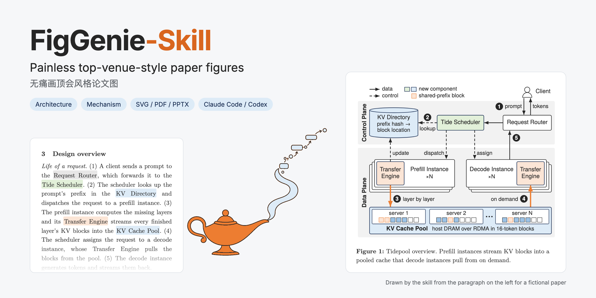
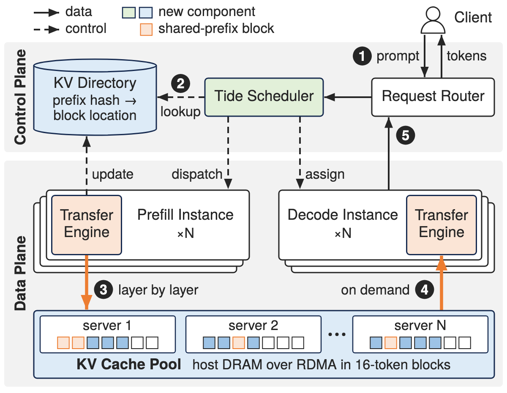
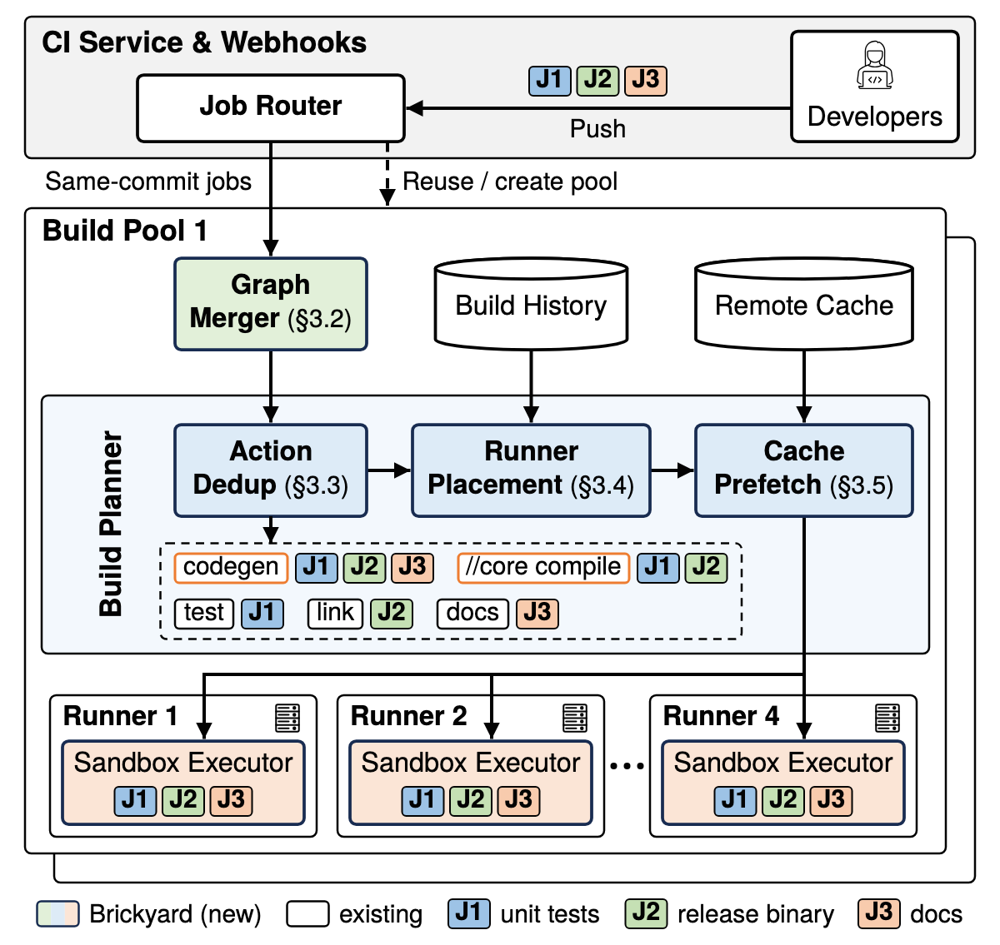
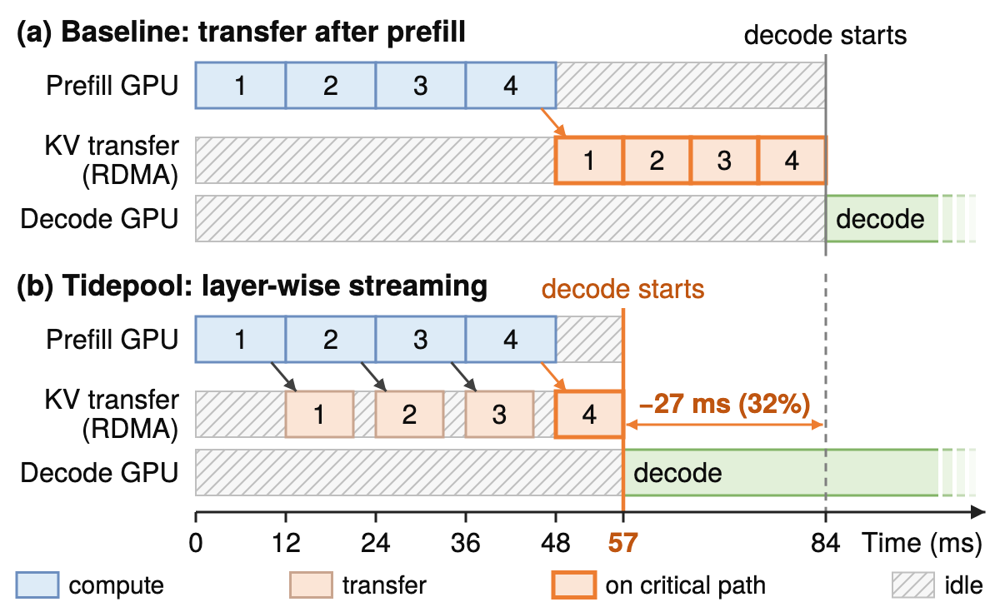
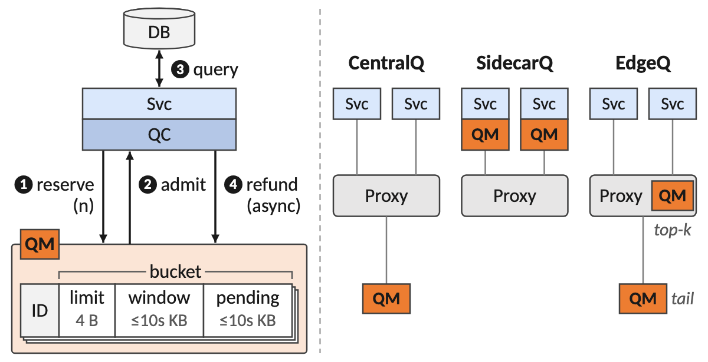
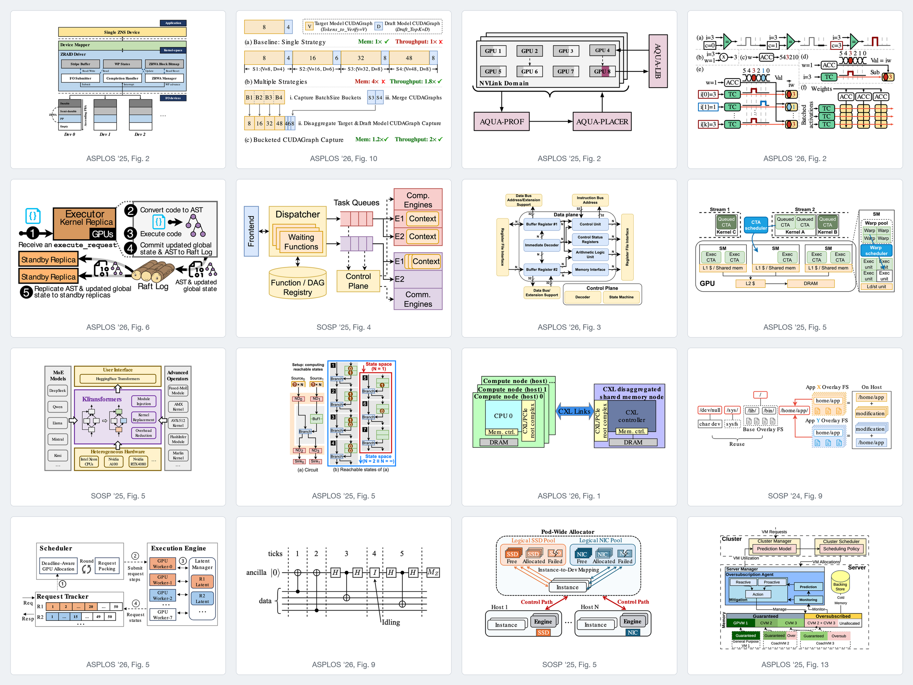
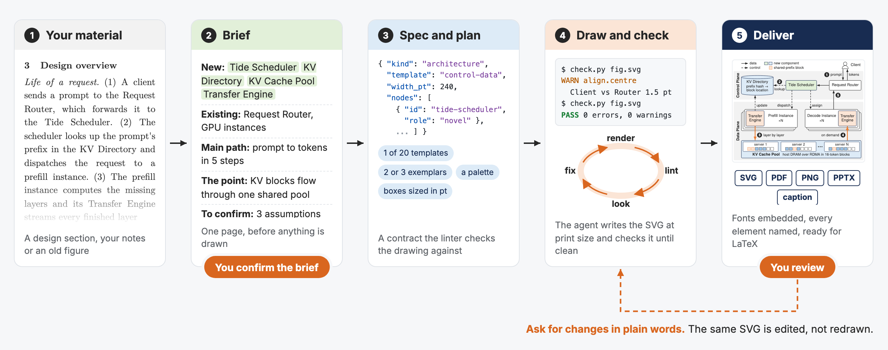
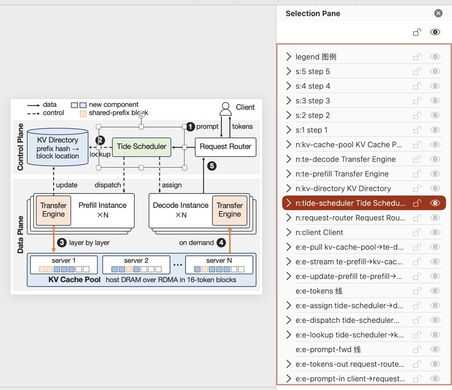
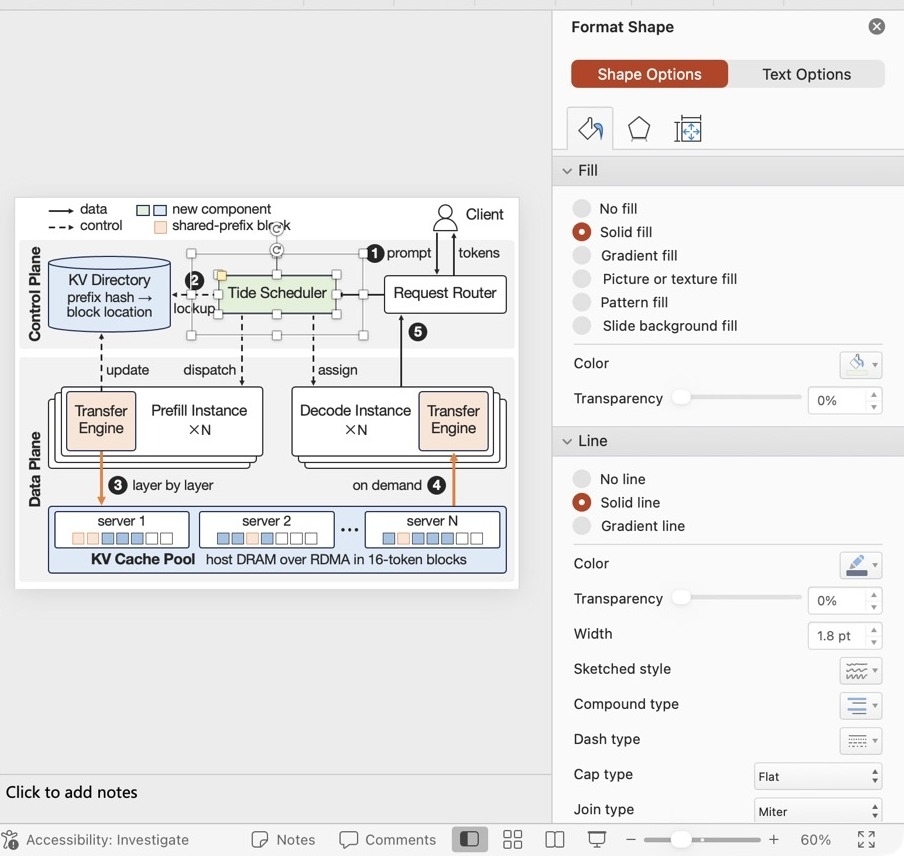
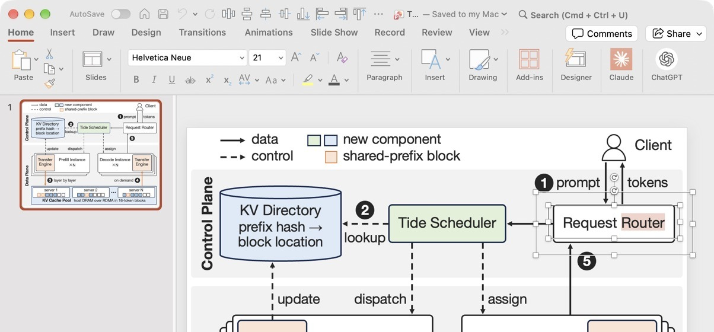

<p align="center">
  <picture>
    <source media="(prefers-color-scheme: dark)" srcset="docs/banner-dark.png">
    
  </picture>
</p>

<p align="center">
  <b>绘制能直接放进顶会论文的图。</b><br>
</p>

<p align="center">
  
  
  
  
  
</p>

<p align="center">
  <a href="#示例"><b>示例</b></a>  | 
  <a href="#为什么选-figgenie">为什么选 FigGenie</a>  | 
  <a href="#快速开始">快速开始</a>  | 
  <a href="#功能">功能</a>  | 
  <a href="README.md">English</a>
</p>

<div align="center">
<table>
  <tr>
    <th valign="top">🏆<br>顶会风格</th>
    <th valign="top">✏️<br>可编辑</th>
    <th valign="top">📐<br>SVG</th>
    <th valign="top">📄<br>PDF</th>
    <th valign="top">📊<br>PPTX</th>
    <th valign="top">🧮<br>公式</th>
    <th valign="top">🀄<br>中文</th>
    <th valign="top">🕹️<br>交互式编辑器</th>
  </tr>
  <tr>
    <td align="center">✅</td>
    <td align="center">✅</td>
    <td align="center">✅</td>
    <td align="center">✅</td>
    <td align="center">✅</td>
    <td align="center">✅</td>
    <td align="center">✅</td>
    <td align="center">🚧</td>
  </tr>
</table>
<sub>✅ 已支持  |  🚧 即将支持</sub>
</div>

## 示例

下面几张图都出自 FigGenie Skill。它画的是可编辑的矢量图，不是图片生成模型生成的位图，可以直接放进 **Illustrator**、**PPT** 等工具里继续修改，中文和公式也都支持。图中的系统、组件和数字均为虚构。

<table>
  <tr>
    <th colspan="2">架构图</th>
  </tr>
  <tr>
    <td width="50%" valign="top">
      
      <br><sub><a href="docs/gallery/tidepool-fig1.svg">SVG</a> / <a href="docs/gallery/tidepool-fig1.pdf">PDF</a> /
      <a href="docs/gallery/tidepool-fig1.pptx">PPTX</a></sub>
    </td>
    <td width="50%" valign="top">
      
      <br><sub><a href="docs/gallery/brickyard-fig1.svg">SVG</a> / <a href="docs/gallery/brickyard-fig1.pdf">PDF</a> /
      <a href="docs/gallery/brickyard-fig1.pptx">PPTX</a></sub>
    </td>
  </tr>
  <tr>
    <th colspan="2">机制图</th>
  </tr>
  <tr>
    <td width="50%" valign="top">
      
      <br><sub><a href="docs/gallery/tidepool-fig4.svg">SVG</a> / <a href="docs/gallery/tidepool-fig4.pdf">PDF</a> /
      <a href="docs/gallery/tidepool-fig4.pptx">PPTX</a></sub>
    </td>
    <td width="50%" valign="top">
      
      <br><sub><a href="docs/gallery/quota-admission.svg">SVG</a> / <a href="docs/gallery/quota-admission.pdf">PDF</a> /
      <a href="docs/gallery/quota-admission.pptx">PPTX</a></sub>
    </td>
  </tr>
</table>

## 为什么选 FigGenie

- **规则来自真实的顶会插图，不凭个人审美**：每条规则都有数据依据，统计自 2,041 张经过人工评分的系统顶会论文插图。
- **按论文的实际尺寸作图**：以 pt 为单位，按 240 pt 的单栏宽度来画，放进论文里文字依然清晰，而不只是在屏幕上好看。
- **绘图检查**：lint 会在无头浏览器里逐个测量图中的元素，agent 还会看一遍渲染结果，确认没问题才交付。

### 从 12,577 张顶会插图中提炼

我们收集了 OSDI、NSDI、SOSP、ASPLOS 2023–2026 年所有论文的插图，并进行了人工评分，再统计好图究竟好在哪里。

| 语料库  | 规模                                                 |
| ---- | -------------------------------------------------- |
| 论文   | OSDI、NSDI、SOSP、ASPLOS 2023–2026 年，共 1,113 篇        |
| 收录插图 | 12,577 张                                           |
| 人工评分 | 2,041 张                                            |
| 提炼出  | 20 种布局模板、5 类机制图、21 套配色方案、485 张带标注的范例图、2,853 个可复用元件 |

<p align="center">
  
  <br><sub>语料库中的 16 张图，均取自以 CC BY 4.0 协议发布的论文。版权归原作者所有，出处见 <a href="CREDITS.md">CREDITS.md</a>。</sub>
</p>

### 绘图流程

<p align="center">
  <picture>
    <source media="(prefers-color-scheme: dark)" srcset="docs/workflow-dark.png">
    
  </picture>
</p>

## 快速开始

直接把本仓库的地址丢给你的 AI，让它帮你安装这个 skill 即可：

```text
帮我安装这个 skill 并配置好依赖：https://github.com/Sleepy-Avacado/FigGenie
```

也可以手动安装：

**Claude Code**：安装插件即可。

```text
/plugin marketplace add Sleepy-Avacado/FigGenie
/plugin install figgenie@figgenie
```

**Codex 及其他 agent**：FigGenie 是一个标准的 Agent Skill，本质上就是一个装着 `SKILL.md`、脚本和参考文档的文件夹。只要你的 agent 能加载 skill、能执行 shell 命令、能查看 PNG 图片，就可以用。

```bash
git clone https://github.com/Sleepy-Avacado/FigGenie.git
mkdir -p ~/.agents/skills
ln -s "$PWD/FigGenie/skills/figgenie-paper-diagram" ~/.agents/skills/figgenie-paper-diagram
```

旧版 Codex 从 `~/.codex/skills` 读取 skill。

**依赖**：Python 3，以及渲染和 lint 要用到的无头 Chromium。

```bash
pip install lxml pillow playwright fonttools
playwright install chromium
```

可选依赖：画公式需要 Node.js 18+（首次使用时会自动安装 MathJax）；导出 PPT 需要 `pip install python-pptx`，如果要在 PPT 里使用原生公式，还需要 Office 自带的 `mathml2omml.xsl`。

## 功能

| 功能     | 内容                                                                       |
| ------ | ------------------------------------------------------------------------ |
| **类型** | 架构图有 20 种布局模板；机制图分为 5 类：方案对比、演变过程、逻辑流程、步骤讲解、结构剖析，还可以配上带真实数值的算例。          |
| **输出** | 内嵌字体、元素均已命名的 SVG；按图的大小裁切、可直接插入 LaTeX 的 PDF；PNG 预览图和图注草稿。需要时还能导出可编辑的 PPT。 |
| **内容** | 矢量 TeX 公式、中文等 CJK 文字、内含 2,853 个元件的图标库，也可以嵌入截图、照片等位图。                     |
| **流程** | 动笔前先出一份绘图大纲请你确认；每次修改后都会跑 lint、检查渲染结果；修改意见用自然语言说就行；也可以点评或重画已有的图。          |

**在 PPT 里直接编辑**：需要时可以把画好的图导出成 PPT，每个图元都是原生形状，位置与 SVG 完全一致。

<table>
  <tr>
    <td width="50%" valign="top"><br><sub>每个元素都是一个组合，以它在 spec 中的 id 命名。</sub></td>
    <td width="50%" valign="top"><br><sub>方框是原生形状，填充和线条都能改。</sub></td>
  </tr>
  <tr>
    <td colspan="2" valign="top"><br><sub>标签是可编辑的文本，字体与图中一致。</sub></td>
  </tr>
</table>

## 路线图

- [ ] 绘制 AI 顶会风格的图（NeurIPS、ICML、ICLR、CVPR、ACL）
- [ ] 交互式的编辑器
- [ ] 支持更多编辑器（Draw.io, OmniGraffle 等）

## 致谢

感谢语料库中各篇论文的作者：FigGenie 的画法都是从他们的插图里学来的，这些图的版权仍归原作者所有。上面那张拼图的出处已在 [CREDITS.md](CREDITS.md) 中逐张注明。本项目用到的字体有 TeX Gyre、Latin Modern、Source Sans、Inter、Roboto、Arimo、Tinos、Carlito 和 DejaVu，公式由 MathJax 排版，渲染使用 Playwright 和 Chromium。

**删除请求**：如果本仓库用到了你的图而你希望撤下，请发邮件到 ahawkinthesky@outlook.com，或在 https://github.com/Sleepy-Avacado/FigGenie/issues 提 issue，我们会将其移除。

## 许可证

代码和文档以 [MIT License](LICENSE) 发布，但以下两类内容除外：

- 取自已发表论文的插图和元件，版权归原作者所有（见 [CREDITS.md](CREDITS.md) 和 [SOURCES.md](SOURCES.md)）；
- 随仓库附带的字体，沿用各自的许可证（见 [`assets/fonts/LICENSES.md`](skills/figgenie-paper-diagram/assets/fonts/LICENSES.md)）。
